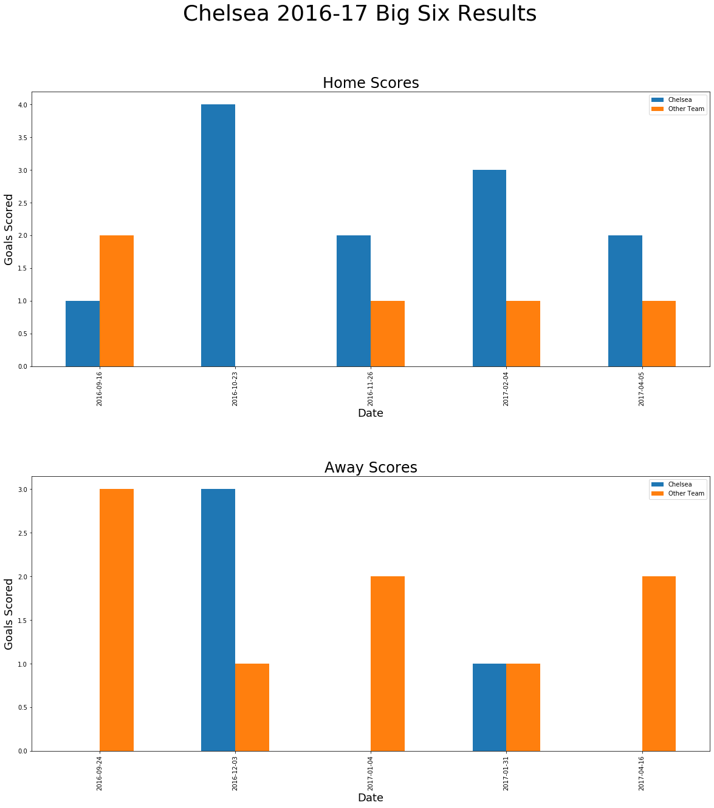
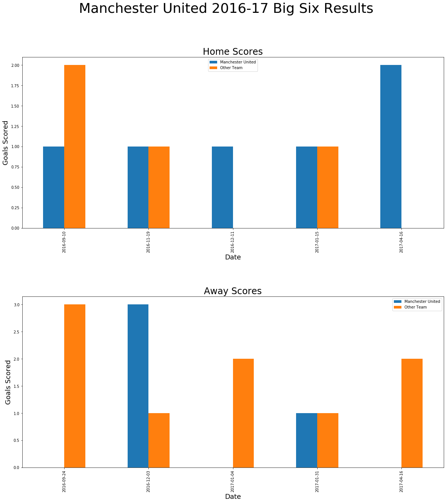
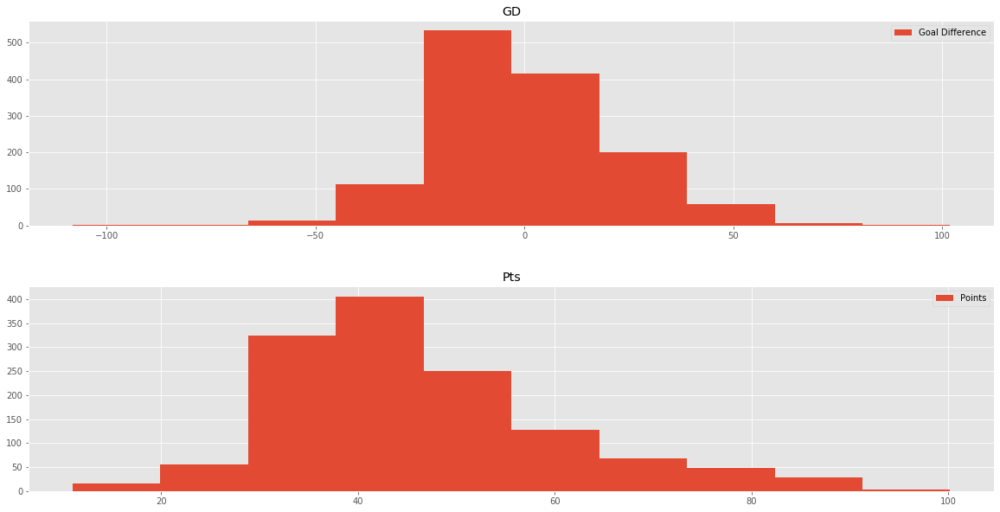

# Predicting the Premier League

## Sources

### FiveThirtyEight
I used data collected from FiveThirtyEight which includes a record of all matches played between 2016 and 2019 for all leagues around the world. This data includes over 32,000 rows including which teams played, projected goals scored, win probabilities, actual goals scored, spi ratings, and more. This data was provided as a CSV file.

### Krysstal.com
I webscraped tables from Krysstal.com that included a table of all Premier League(or English Top Flight) Champions since the beginning of the competition. From this data I was able to display running totals of championships won.

### Kaggle.com
From Kaggle I used a CSV including the final league tables from the top English league from before the 1890s to the 2016 season. This included the standard data provided in most league tables, such as games played, points, goal difference, wins, draws, losses, etc.

## Initial EDA
After importing the data, I decided to process my data through increasing degrees of specificity. Some of these tables are not fully complete with labels and proper formatting.

I first started to display total titles earned by club:

I then included a plot of running totals over the years:

And a somewhat clearer version:

After plotting the data, I saw that only a few teams have won in recent history, so I decided to see how the teams performed in terms of league position and not just title win. Since the plot was congested, I decided to separate the data in to the "Big Six"(six clubs widely known to be the most dominant in recent history) as well as other teams with a consistent presence in the Premier League.

Here it is easier to see the congregation of the big teams towards the top of the title while the other teams have remained primarily in the remaining spots with little exposure to the top 5 or 6 positions. I believe further analysis on this topic is possible.

From here I wanted to explore what constitutes a team winning the league starting with goals scored. This plot shows data on two championship teams over the course of a single season. This shows each match result separated into Home and Away games as well as their projected goals to see how they performed against their own form and their opponent's form.

It appears from these plots that Chelsea primarily exceeded their projected scores when they won the title while Manchester City seemed to match or just fall short of projected scores.

After observing this data I wanted to see if there is a relationship between Goal Difference(Goals Scored - Goals Scored Against) and Points earned in a season:

It seems as though there are some similarities between the two, but it is not a perfect relationship. I plan to see if hypothesis testing can help discover some information about this data.

### Wednesday Progress
I created plots demonstrating three "Big Six" teams' performances against other "Big Six" teams to explore the importance of performance against other title contenders . Two of the plots show teams who won the league that season(Chelsea and Manchester City) while the third shows a team which underperformed that season(Manchester United).

I wanted to further explore the importance of goal difference in a team's performance in the league. I created a histogram of both Goal Difference and Final Season Points. Goal Difference is centered around 0, as the net Goal Difference should be 0 before scaling the data. Points centers around the 40-50 mark with some skewedness towards the higher point ranges.

To further see the relationship between Goal Difference and Points, I plotted league winners' Points versus Goal Differences in a scatter. 

I then compared this to the distribution of the entire league throughout the years. League winning teams' data are displayed in black bold dots. There seemed to be two distinct trends appearing in the data, so I decided to plot Wins versus Goal Differences, which showed a much stronger relationship. I believe this is due to the impact of ties in games. With wins, each team receives an average of 1.5 points, while in a draw teams receive an average of 1 point, which results in a less steep curve.

The axes will be properly labeled as soon as possible.
